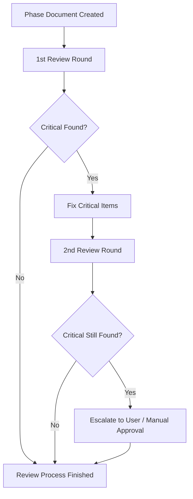

# limit-review-cycles Engineering Document

> **Summary**: PEDAL 사이클 리뷰 프로세스를 2회로 제한하고, 2차 리뷰 조건을 설정하는 기술 설계.
>
> **Project**: PEDAL
> **Version**: 2.0
> **Author**: Gemini CLI
> **Date**: 2026-04-16
> **Status**: Approved
> **Planning Doc**: [limit-review-cycles.plan.md](../01-plan/limit-review-cycles.plan.md)

### Related Documents

| Document                                 | Status    |
| ---------------------------------------- | --------- |
| [Wiki (SSOT)](../wiki/index.md)          | ✅ |
| [Plan](../01-plan/limit-review-cycles.plan.md)     | ✅ |
| [Conventions](../wiki/CONVENTIONS.md) | ✅ |
| [Prompt](../01-plan/limit-review-cycles.prompt.md) | ✅ |

---

## 1. Overview

### 1.1 Engineering Goals

- `.pedal/PEDAL.md`, `.pedal/REVIEW.md`, `GEMINI.md`의 리뷰 관련 섹션을 수정하여 명확한 횟수 제한과 조건을 명시함.
- 에이전트가 리뷰 결과에 따라 다음 단계를 결정하는 로직(상태 전이)을 명문화함.

### 1.2 Engineering Principles

- **Brevity**: 리뷰 루프를 줄여 개발 효율성을 극대화함.
- **Clarity**: 리뷰 종료 및 에스컬레이션 조건을 모호하지 않게 정의함.
- **Consistency**: 모든 가이드 문서 간의 내용 불일치를 제거함.

---

## 2. Architecture

### 2.1 Review Process Flow (Logic)



---

## 3. Implementation Details (Document Updates)

### 3.1 공통 정책 문구 (Common Policy Text)

모든 관련 문서에 삽입할 공통 정책의 핵심 문구는 다음과 같음:
> "리뷰는 최대 2회로 제한한다. 2차 리뷰는 1차 리뷰 결과에 'Critical' 항목이 포함된 경우에만 수행하며, 2차 리뷰 후에는 결과(Critical 잔존 여부)와 상관없이 리뷰 루프를 종료한다. 만약 2차 리뷰 후에도 Critical 항목이 해결되지 않는다면 사용자에게 보고하고 지시를 기다린다."

### 3.2 .pedal/PEDAL.md 수정 사항

- **Cross-review** 섹션에 위 정책 문구 반영.
- **learn** 및 **archive** 섹션에서 리뷰 관련 언급 시 2회 제한 원칙 준수 확인.

### 3.3 .pedal/REVIEW.md 수정 사항

- **Main agent response to review** 섹션 수정:
  - 1차 리뷰 후 Critical이 없을 경우: 즉시 다음 단계 진행.
  - 1차 리뷰 후 Critical이 있을 경우: 수정 후 2차 리뷰 요청.
  - 2차 리뷰 후: 결과와 상관없이 리뷰 루프 종료. (Critical 잔존 시 사용자 개입 요청)

### 3.4 GEMINI.md 수정 사항

- **Cross-review (when Gemini is main agent)** 섹션 수정:
  - 에이전트가 스스로 판단하여 2차 리뷰 여부를 결정하도록 가이드 업데이트.

---

## 4. Test Plan

### 4.1 Test Scope

| Type             | Target         | Tool          |
| ---------------- | -------------- | ------------- |
| Documentation Review | Updated Markdown files | Manual / Self-review |
| Logic Verification | Reviewer response simulation | Manual |

### 4.2 Test Cases (Key)

- [x] **Case 1 (Happy Path)**: 1차 리뷰에서 Critical 없음 -> 리뷰 종료 확인.
- [x] **Case 2 (Warning Only)**: 1차 리뷰에서 Warning만 있고 Critical 없음 -> 2차 리뷰 없이 종료 확인.
- [x] **Case 3 (2nd Round Trigger)**: 1차 리뷰에서 Critical 발생 -> 수정 후 2차 리뷰 수행 확인.
- [x] **Case 4 (Max Limit)**: 2차 리뷰 후에도 Critical 발생 -> 3차 리뷰 미수행 및 사용자 에스컬레이션 확인.

---

## 5. Coding Convention Reference

- [x] Gitmoji 사용 (feat: ✨, docs: 📝 등)
- [x] Markdown 문법 준수

---

## 6. Implementation Guide

### 6.1 Implementation Order

1. [ ] `.pedal/REVIEW.md` 수정 (프로토콜의 핵심)
2. [ ] `.pedal/PEDAL.md` 수정 (전체 워크플로 반영)
3. [ ] `GEMINI.md` 수정 (에이전트 별 지침 반영)

---

## 7. Self-Review Criteria (Do → Analyze Gate)

### 7.1 Implementation Completeness

- 리뷰 횟수 제한(2회) 명시 여부
- 2차 리뷰 트리거 조건(Critical 존재 시) 명시 여부
- 2차 리뷰 후 종료/에스컬레이션 규칙 명시 여부
- 3개 문서(PEDAL.md, REVIEW.md, GEMINI.md)의 일관성

### 7.2 Ready for Analyze

```bash
/pedal analyze limit-review-cycles
```

---

## Version History

| Version | Date   | Changes       | Author   |
| ------- | ------ | ------------- | -------- |
| 0.2     | 2026-04-16 | Addressed review feedback (Diagram, Exit rules, Text draft) | Gemini CLI |
| 0.1     | 2026-04-16 | Initial draft | Gemini CLI |
